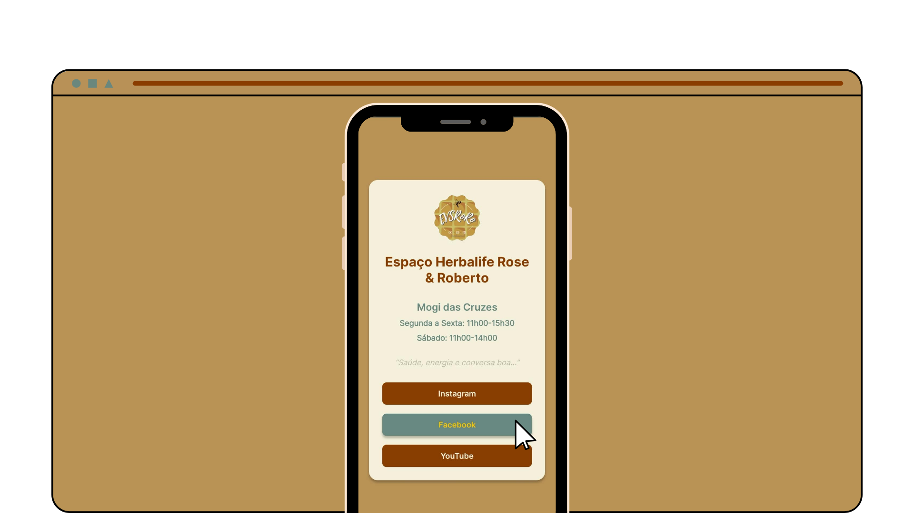

# Frontend Mentor - Social links profile solution

This is a solution to the [Social links profile challenge on Frontend Mentor](https://www.frontendmentor.io/challenges/social-links-profile-UG32l9m6dQ).

## Overview

### The challenge

Users should be able to:

- See hover and focus states for all interactive elements on the page

### Screenshot



### Links

- Solution URL: [Frontend Mentor](https://www.frontendmentor.io/solutions/semantic-html5-markup-css-custom-properties-and-css-grid-e75vO6r9B3)
- Live Site URL: [evs-links](https://dev-corvus.github.io/evs-links/)

## My process

### Built with

- Semantic HTML5 markup
- CSS custom properties
- CSS Grid

### What I learned
The :last-child CSS pseudo-class matches an element only if it is the absolute last child inside its parent container

```css
li {
    margin-bottom: 16px;
}

li:last-child{
    margin-bottom: 0;
}
    
```

### Useful resources

- [Git/GitHub](https://www.tabnews.com.br/RafaelBESO/git-o-basico-que-vai-fazer-voce-parecer-um-mestre)
- [Markdown Guide](https://www.markdownguide.org/basic-syntax/)
- [CSS Selectors](https://www.alura.com.br/artigos/css-seletores-avancados-aplicacoes-web?srsltid=AU7gw4UPhoYxLFucuPgUjgVIArAsplE0oSw0kZb3BuHe0Uh2byPMJEJY)

## Acknowledgments

Hats off to Mago da Silva